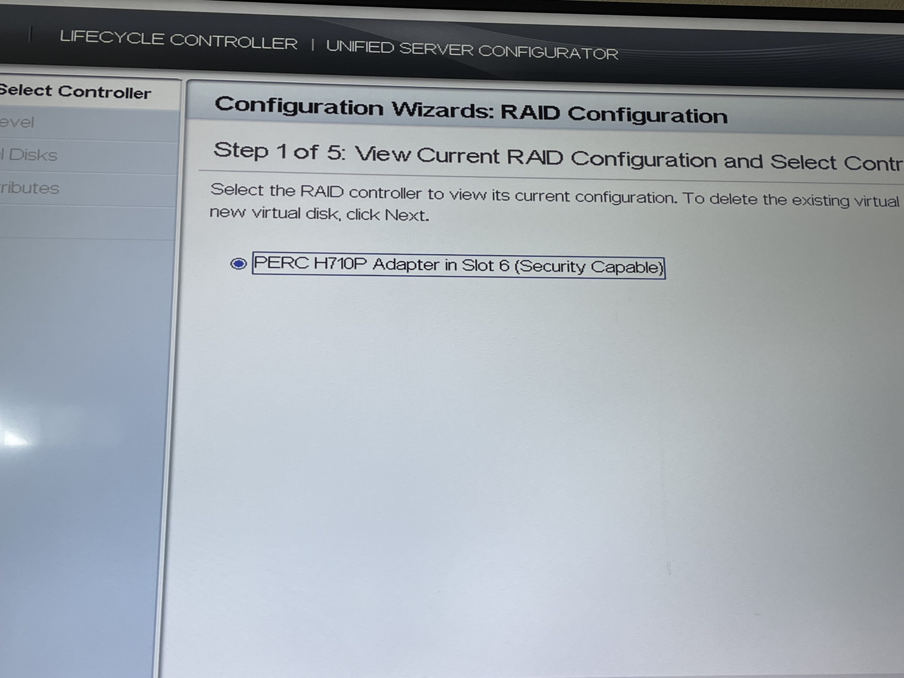
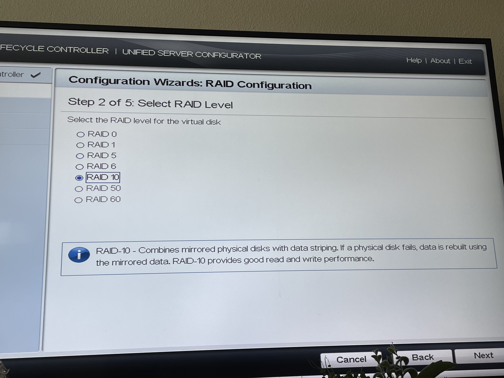
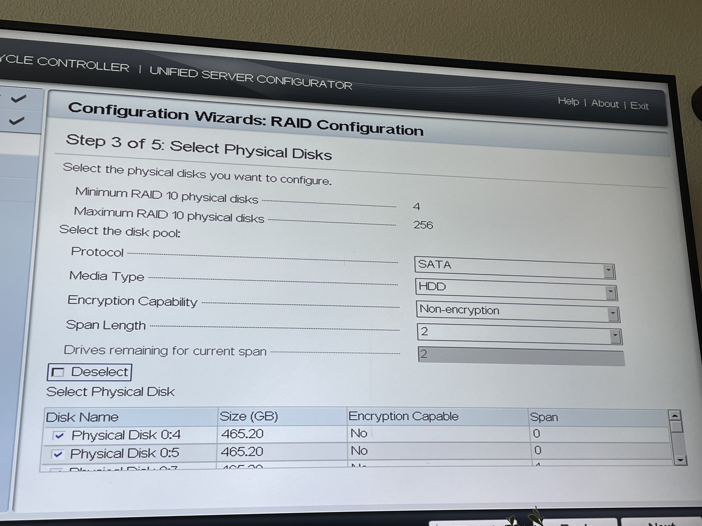
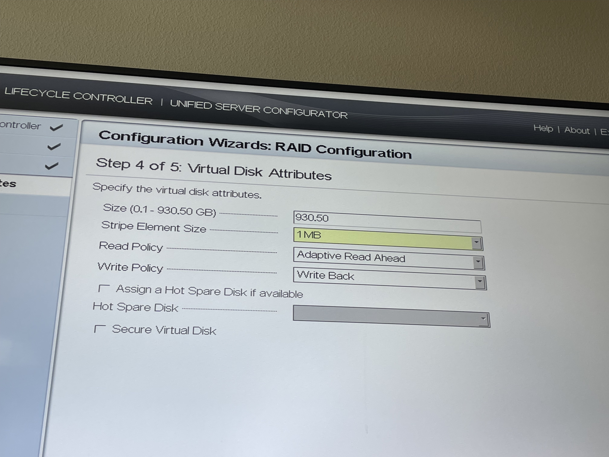
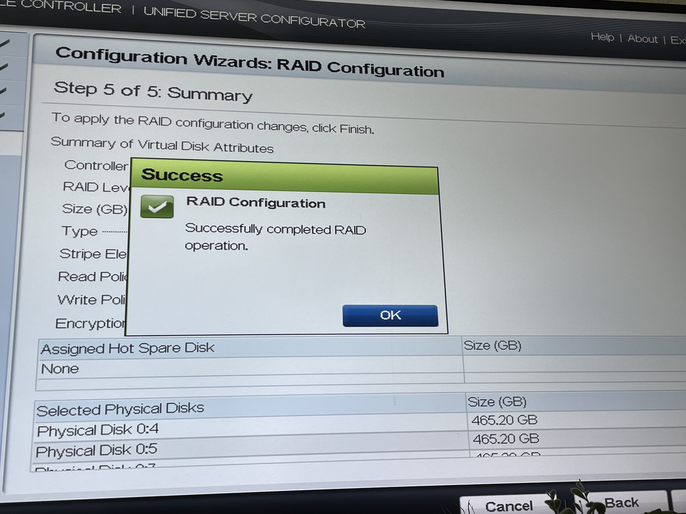
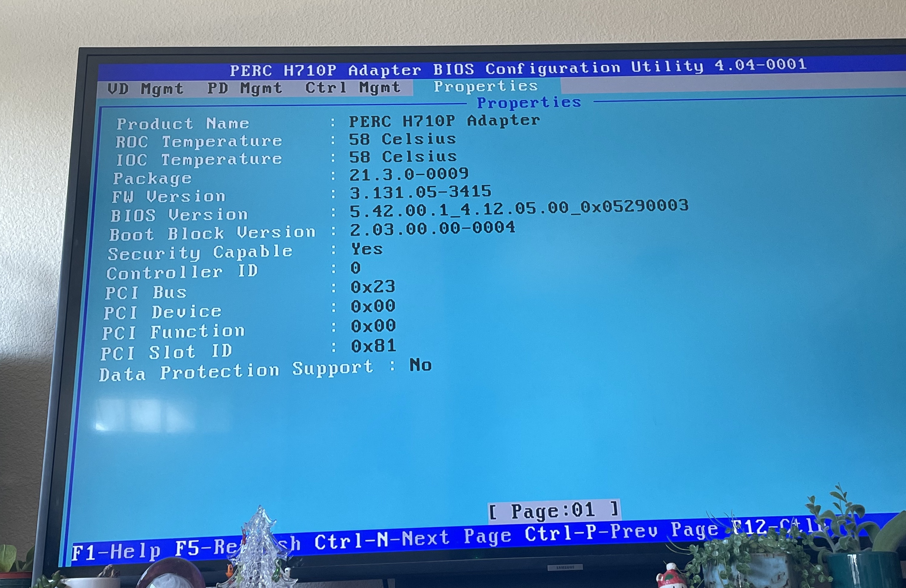

# raid-dell
Setting up my first "large" RAID storage machine
## Description
I'm using a Dell Poweredge T320 Server to host my hard drives for photo backups.
## Goal 
The goal for this project is to have an actually safe storage for my photos and videos that aren't in the cloud. I'm aiming for the 3-2-1 storage solution motto ultimately.

### Notes 12/18/2022
> Found web [file broswer](https://filebrowser.org/) that is sleek and opensource with authentication json and can upload and download. Got it setup and working in a [service file](https://linuxhandbook.com/create-systemd-services/). Setup a user and proper proxmox permissions for the shared storage with [Bind Mount Points](https://pve.proxmox.com/wiki/Linux_Container#_bind_mount_points) and [some UID/GID permissions](https://www.reddit.com/r/homelab/comments/6p3xdw/comment/dkncmrc/). [Named](https://namingschemes.com/Trees) it the Oak1. ~~Need to fix an issue with FileBrowser not having perms to make directories.~~

> Fixed the perm issue and decided to offer a [JellyFin](https://jellyfin.org/) service to stream home videos and music.

### Notes 12/17/2022
> So I tried to update the BIOS on the Dell T320. Just had make sure to include the correct efi file (v2.9.0 from v2.1.0) on a usbstick and it worked like a charm. Then I made the RAID 10 with all four 500GB drives I had. 

<table float="left">
  <tr>
    <td><strong>Step 1</strong></td>
    <td><strong>Step 2</strong></td>
    <td><strong>Step 3</strong></td>
    <td><strong>Step 4</strong></td>
    <td><strong>Step 5</strong></td>
  </tr>
  <tr>
    <th></th>
    <th></th>
    <th></th>
    <th></th>
    <th></th>
  </tr>
</table>

> After toiling for a solution all yesterday, I woke up and found that the card and lifecycle controller (v1.64.64.64) was not at fault. I plugged the PERC H710P into my desktop and it booted straight to the card BIOS which is good news.

> Also yesterday I managed to install the new CPU and its great having 20 threads. Gonna observe how the TDP behaves because we're going for low power in the future. I wanted real low power I would have bought a descrete NAS, but these are just the parts I have on hand.

### Notes 12/16/2022
>Found a possible solution by installing just a driver found through this serverfault [post](https://serverfault.com/questions/1090959/dell-perc-h750-compatibility-with-debian) and I added it to this repository. Backup method is to flash the H710P controller to LSI IT Firmware as seen in this [guide](https://fohdeesha.com/docs/perc.html), but that would defeat the purpose of paying the $67 since other LSI controlers are half the price.

### Notes 12/4/2022
> So the preivous card (H710P Mini) was not compatible with this server, but might be with some of the servers I own with John. I bought a H710P PCI-E ($67) so the price of this project has increased rip.

> The H710P PCI-E arrived and as I tried to install it I've run into problems. The BIOS doesn't recognize the controller or the LifeCycle controller never boots if the RAID card is plugged in. I'm thinking the issue is either driver problems (finding a working debian x86_64 driver is more difficult than it should be) or I need to change the boot setup options for RAID. If either of these don't work I'm thinking the firmware on the controller might be broken or something (there is a green flashing light) which means I have to flash new firmware. Flashing firmware onto the H710P might not be possible to do.

### Notes 11/20/2022
> For now here is my issue: The server for some reason doesn't have a raid card preinstalled. So do I buy a new raid card? or software raid? I think I'll just spend the $20 since I don't want to take any  chances. Unfortunatly this server doesn't have hot-swap bays so when I need it in the future I need a 2x2tb solution and will have to replace drives instead of just adding more in!

### Notes Previous
> I bought an Intel Xeon E5 2470 V2 LGA1356 CPU for $17! Coming Nov 23-26?

> Specs: 2.4Ghz (Boost 3.2Ghz), 25MB L3Cache, 10 Core, 20 threads, 22nm process, Ivy Bridge EN
